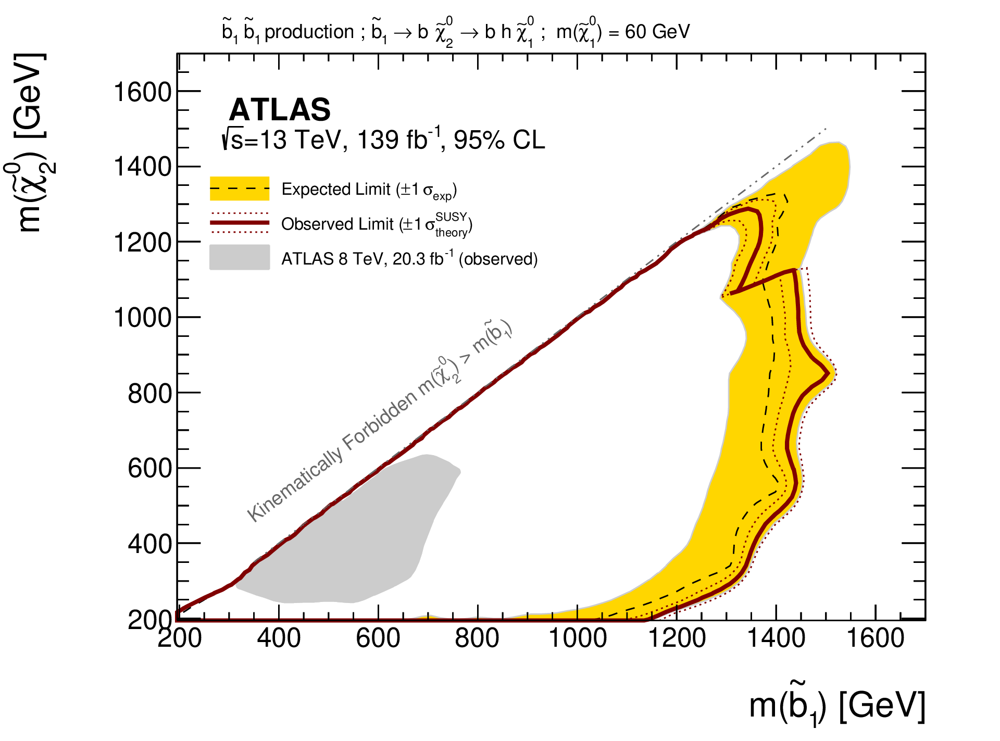
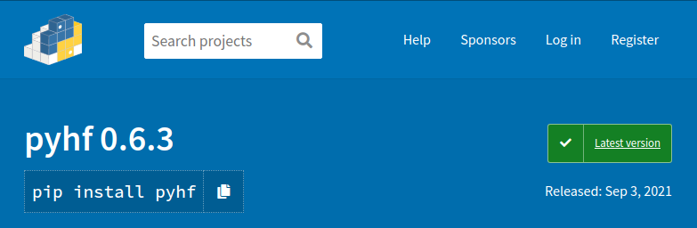
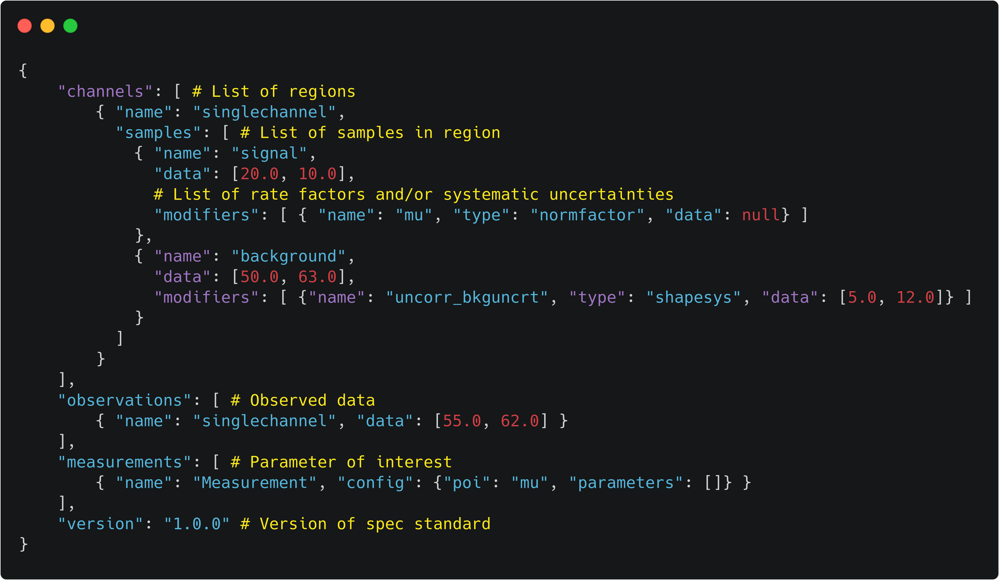
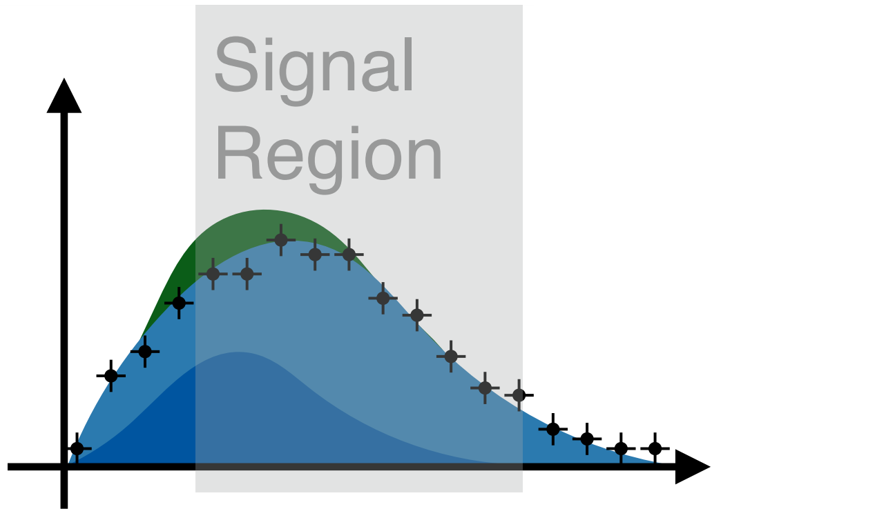
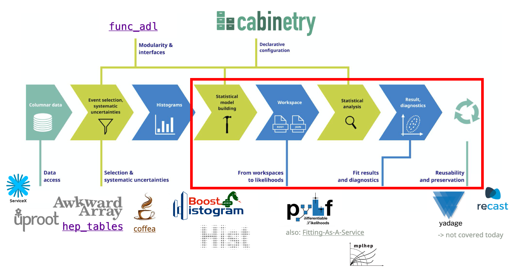
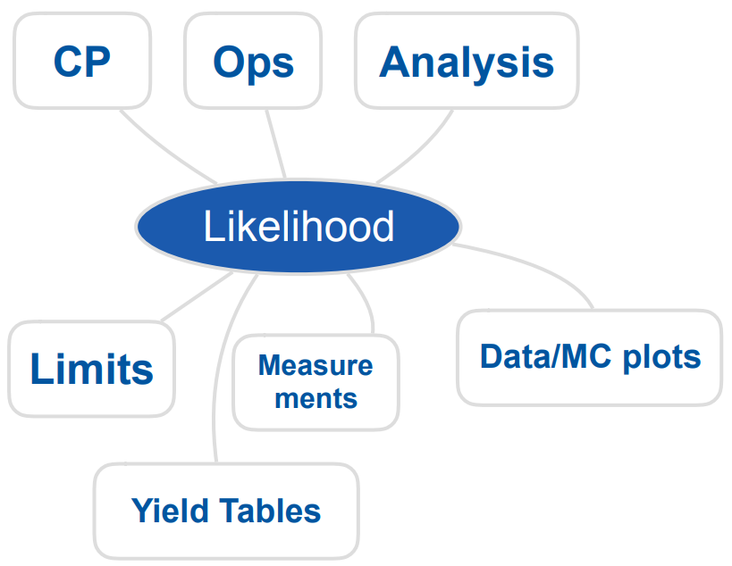

class: middle, center, title-slide
count: false

# `pyhf`: pure-Python implementation of HistFactory with tensors and automatic differentiation

 

.huge.blue[Matthew Feickert] 
.huge[(University of Illinois at Urbana-Champaign)]
  
[matthew.feickert@cern.ch](mailto:matthew.feickert@cern.ch)

[CMS Analysis Tools Task Force meeting](https://indico.cern.ch/event/XXXXXX/contributions/YYYYYYY/)

December 1st, 2021

---
# Talk information
  

- 20 minute presentation on pyhf
- talk scope: an introduction and discussion of backends / interface / project scope. Publishable likelihoods and related stuff [Lindsey] think[s] are for a later time, the feel of this meeting is more to discuss the statistical tools directly.

---
# `pyhf` team

  

.grid[
.kol-1-3.center[
.circle.width-80[]

[Lukas Heinrich](https://github.com/lukasheinrich)

CERN
]
.kol-1-3.center[
.circle.width-80[]

[Matthew Feickert](https://www.matthewfeickert.com/)

Illinois
]
.kol-1-3.center[
.circle.width-75[]

[Giordon Stark](https://github.com/kratsg)

UCSC SCIPP
]
]

---
# Goals of physics analysis at the LHC

.kol-1-1[
.kol-1-3.center[
.width-100[]
Search for new physics
]
.kol-1-3.center[
 
.width-100[]

 
Make precision measurements
]
.kol-1-3.center[
.width-110[]

Provide constraints on models through setting best limits
]
]

- All require .bold[building statistical models] and .bold[fitting models] to data to perform statistical inference
- Model complexity can be huge for complicated searches
- **Problem:** Time to fit can be .bold[many hours]
- .blue[Goal:] Empower analysts with fast fits and expressive models

---
# HistFactory Model

- A flexible probability density function (p.d.f.) template to build statistical models in high energy physics
- Developed in 2011 during work that lead to the Higgs discovery [[CERN-OPEN-2012-016](http://inspirehep.net/record/1236448)]
- Widely used by ATLAS for .bold[measurements of known physics] (Standard Model) and .bold[searches for new physics] (beyond the Standard Model)

.kol-2-5.center[
.width-90[]
.bold[Standard Model]
]
.kol-3-5.center[
.width-100[]
.bold[Beyond the Standard Model]
]

---
# HistFactory Model: Systematic uncertainties

- Use Alex's slide as a guide https://indico.cern.ch/event/1076231/contributions/4560405/attachments/2338312/3986005/20211103_pyhf_cabinetry_AGC.pdf

---
# HistFactory Template

$$
f\left(\mathrm{data}\middle|\mathrm{parameters}\right) =  f\left(\vec{n}, \vec{a}\middle|\vec{\eta}, \vec{\chi}\right) = \color{blue}{\prod\_{c \\,\in\\, \textrm{channels}} \prod\_{b \\,\in\\, \textrm{bins}\_c} \textrm{Pois} \left(n\_{cb} \middle| \nu\_{cb}\left(\vec{\eta}, \vec{\chi}\right)\right)} \\,\color{red}{\prod\_{\chi \\,\in\\, \vec{\chi}} c\_{\chi} \left(a\_{\chi}\middle|\chi\right)}
$$

.bold[Use:] Multiple disjoint _channels_ (or regions) of binned distributions with multiple _samples_ contributing to each with additional (possibly shared) systematics between sample estimates

.kol-1-2[
.bold[Main pieces:]
- .blue[Main Poisson p.d.f. for simultaneous measurement of multiple channels]
- .katex[Event rates] $\nu\_{cb}$ (nominal rate $\nu\_{scb}^{0}$ with rate modifiers)
- .red[Constraint p.d.f. (+ data) for "auxiliary measurements"]
   - encode systematic uncertainties (e.g. normalization, shape)
- $\vec{n}$: events, $\vec{a}$: auxiliary data, $\vec{\eta}$: unconstrained pars, $\vec{\chi}$: constrained pars
]
.kol-1-2[
.center.width-100[]
.center[Example: .bold[Each bin] is separate (1-bin) _channel_,  each .bold[histogram] (color) is a _sample_ and share  a .bold[normalization systematic] uncertainty]
]

---
# HistFactory Template

$$
f\left(\vec{n}, \vec{a}\middle|\vec{\eta}, \vec{\chi}\right) = \color{blue}{\prod\_{c \\,\in\\, \textrm{channels}} \prod\_{b \\,\in\\, \textrm{bins}\_c} \textrm{Pois} \left(n\_{cb} \middle| \nu\_{cb}\left(\vec{\eta}, \vec{\chi}\right)\right)} \\,\color{red}{\prod\_{\chi \\,\in\\, \vec{\chi}} c\_{\chi} \left(a\_{\chi}\middle|\chi\right)}
$$

Mathematical grammar for a simultaneous fit with

- .blue[multiple "channels"] (analysis regions, (stacks of) histograms)
- each region can have .blue[multiple bins]
- coupled to a set of .red[constraint terms]

.center[.bold[This is a _mathematical_ representation!] Nowhere is any software spec defined]
.center[.bold[Until 2018] the only implementation of HistFactory has been in [`ROOT`](https://root.cern.ch/)]

.bold[`pyhf`: HistFactory in pure Python]
.center.width-70[]

---
# `pyhf`: HistFactory in pure Python
<!--  -->
.kol-1-2.width-95[
- First non-ROOT implementation of the HistFactory p.d.f. template
   - .width-40[]
- pure-Python library as second implementation of HistFactory
  - [`$ pip install pyhf`](https://scikit-hep.org/pyhf/installation.html#install-from-pypi)
  - No dependence on ROOT!
]
.kol-1-2.center.width-80[

]
<!--  -->
.kol-1-1[
- Open source tool for all of HEP
   - [IRIS-HEP](https://iris-hep.org/projects/pyhf.html) supported Scikit-HEP project
   - Used for reinterpretation in phenomenology paper (DOI: [10.1007/JHEP04(2019)144](https://inspirehep.net/record/1698425)) and `SModelS`
   - Used in ATLAS SUSY, Exotics, and Top groups
   - Used by Belle II (DOI: [10.1103/PhysRevLett.127.181802](https://inspirehep.net/literature/1860766))
   - Keen to make a bridge to CMS!
]

---
# Machine Learning Frameworks for Computation

.grid[
.kol-2-3[
- All numerical operations implemented in .bold[tensor backends] through an API of $n$-dimensional array operations
- Using deep learning frameworks as computational backends allows for .bold[exploitation of auto differentiation (autograd) and GPU acceleration]
- As huge buy in from industry we benefit for free as these frameworks are .bold[continually improved] by professional software engineers (physicists are not)

.kol-1-2.center[
.width-90[]
]
.kol-1-2[
 
- Show hardware acceleration giving .bold[order of magnitude speedup] for some models!
- Improvements over traditional
   - 10 hrs to 30 min; 20 min to 10 sec
]
]
.kol-1-4.center[
.width-85[]
.width-85[]
.width-85[]

 
.width-50[]
]
]

---
# Automatic differentiation

With tensor library backends gain access to _exact (higher order) derivatives_ &mdash; accuracy is only limited by floating point precision

$$
\frac{\partial L}{\partial \mu}, \frac{\partial L}{\partial \theta_{i}}
$$

.grid[
.kol-1-2[
.large[Exploit .bold[full gradient of the likelihood] with .bold[modern optimizers] to help speedup fit!]

  
.large[Gain this through the frameworks creating _computational directed acyclic graphs_ and then applying the chain rule (to the operations)]
]
.kol-1-2[
.center.width-80[]
]
]

---
# JSON spec fully describes the HistFactory model

.kol-1-4.width-100[
- Human & machine readable .bold[declarative] statistical models
- Industry standard
   - Will be with us forever
- Parsable by every language
   - Highly portable
   - Bidirectional translation  with ROOT
- Versionable and easily preserved
   - JSON Schema [describing  HistFactory specification](https://scikit-hep.org/pyhf/likelihood.html#bibliography)
   - Attractive for analysis preservation
   - Highly compressible
]
.kol-3-4.center[
.width-105[]

.center[[`JSON` defining a single channel, two bin counting experiment with systematics](https://scikit-hep.org/pyhf/likelihood.html#toy-example)]
]

---
# ATLAS validation and publication of likelihoods

.kol-1-2[
.center.width-100[]

.center.width-90[]

 
.center[(ATLAS, 2019)]
]
.kol-1-2[
.center.width-100[]
.center[(CERN, 2020)]
]

---
# JSON Patch for signal model (reinterpretation)
<!--  -->
.center[JSON Patch gives ability to .bold[easily mutate model]]
.center[Think: test a .bold[new theory] with a .bold[new patch]!]
.center[(c.f. [Lukas Heinrich's RECAST talk from Snowmass 2021 Computational Frontier Workshop](https://indico.fnal.gov/event/43829/contributions/193817/))]
 
.center[Combined with RECAST gives powerful tool for .bold[reinterpretation studies]]
<!--  -->
.kol-1-5[
 
 
 
 
.center.width-100[]
.center[Signal model A]
]
.kol-3-5[
<!-- Using Perl style in Carbon -->
.center.width-100[]
]
.kol-1-5[
 
 
 
 
.center.width-100[]
.center[Signal model B]
]

---
# Likelihoods preserved on HEPData

- `pyhf` pallet:
   - Background-only model JSON stored
   - Hundreds of signal model JSON Patches stored together as a [`pyhf` "patch set" file](https://scikit-hep.org/pyhf/_generated/pyhf.patchset.PatchSet.html)
- Fully preserve and publish the full statistical model and observations to give likelihood
   - with own DOI! .width-20[]

.kol-3-5[
[.center.width-100[]](https://www.hepdata.net/record/ins1755298)
]
.kol-2-5[
 
.center.width-85[]
]

---
# ...can be used from HEPData

- `pyhf` pallet:
   - Background-only model JSON stored
   - Hundreds of signal model JSON Patches stored together as a [`pyhf` "patch set" file](https://scikit-hep.org/pyhf/_generated/pyhf.patchset.PatchSet.html)
- Fully preserve and publish the full statistical model and observations to give likelihood
   - with own DOI! .width-20[]

.center.width-90[]

---
# Rapid adoption in ATLAS...
<!--  -->
.kol-1-3[
- **18** ATLAS SUSY, Exotics, Top analyses with full probability models published to HEPData
- ATLAS SUSY will be continuing to publish full Run 2 likelihoods
]
.kol-2-3[
- direct staus, [doi:10.17182/hepdata.89408](https://doi.org/10.17182/hepdata.89408) (2019)
- sbottom multi-b, [doi:10.17182/hepdata.91127](https://doi.org/10.17182/hepdata.91127) (2019)
- 1Lbb, [doi:10.17182/hepdata.92006](https://doi.org/10.17182/hepdata.92006) (2019)
- 3L eRJR, [doi:10.17182/hepdata.90607](https://doi.org/10.17182/hepdata.90607) (2020)
- ss3L search, [doi:10.17182/hepdata.91214](https://doi.org/10.17182/hepdata.91214) (2020)
]
.kol-1-1[
.kol-1-1[
.kol-1-2[
.center.width-70[]
]
.kol-1-2[
.center.width-70[]
]
]
.center.smaller[SUSY [EWK 3L RPV](https://atlas.cern/updates/physics-briefing/fantastic-decays-and-where-find-them) analysis ([ATLAS-CONF-2020-009](https://atlas.web.cern.ch/Atlas/GROUPS/PHYSICS/CONFNOTES/ATLAS-CONF-2020-009/)): Exclusion curves as a function of mass and branching fraction to $Z$ bosons]
]

---
# ...and by theory

.kol-1-3[
- `pyhf` likelihoods discussed in
   - [Les Houches 2019 Physics at TeV Colliders: New Physics Working Group Report](https://inspirehep.net/literature/1782722)
   - [Higgs boson potential at colliders: status and perspectives](https://inspirehep.net/literature/1757043)
- [SModelS](https://smodels.github.io/) team has implemented a `SModelS`/`pyhf` interface [[arXiv:2009.01809](https://inspirehep.net/literature/1814793)]
   - tool for interpreting simplified-model results from the LHC
   - designed to be used by theorists
   - `SModelS` authors giving [tutorial later today](https://indico.cern.ch/event/955391/contributions/4084223/)!
]
.kol-2-3[
.center.width-100[]
.center.smaller[[Feedback on use of public Likelihoods](https://indico.cern.ch/event/957797/contributions/4026032/), Sabine Kraml (ATLAS Exotics + SUSY Reinterpretations Workshop)]
<!--  -->
]
- Have produced three comparisons to published ATLAS likelihoods: [ATLAS-SUSY-2018-04](https://atlas.web.cern.ch/Atlas/GROUPS/PHYSICS/PAPERS/SUSY-2018-04/), [ATLAS-SUSY-2018-31](https://atlas.web.cern.ch/Atlas/GROUPS/PHYSICS/PAPERS/SUSY-2018-31/), [ATLAS-SUSY-2019-08](https://atlas.web.cern.ch/Atlas/GROUPS/PHYSICS/PAPERS/SUSY-2019-08/)
   - Compare simplified likelihood (bestSR) to full likelihood (`pyhf`) using `SModelS`

---
# Extending and visualization: cabinetry

.kol-1-3[
 
- pyhf focuses on the modeling (library not a framework)
- cabinetry designs & steers template profile likelihood fits
- Uses pyhf as the inference engine
- Provides common visualization for inference validation
]
.kol-2-3[
.center.width-50[]
.center.width-100[]
]

---
# Core part of IRIS-HEP Analysis Systems pipeline
.center[
.width-75[]
]
- .large[Accelerating fitting (reducing time to .bold[insight] (statistical inference)!)] (`pyhf` + `cabinetry`)
- .large[Flexible schema great for open likelihood .bold[preservation]]
   - .normal[Likelihood serves as high information-density summary of analysis]
- .large[An enabling technology for .bold[reinterpretation]] (`pyhf` + RECAST)

---
# Call for work

.kol-1-2[
- IRIS-HEP Fellow position
   - [.bold[A pyhf converter for binned likelihood models in CMS Combine]](https://iris-hep.org/fellow_projects.html)
]
.kol-1-2[
.center.width-100[]
.center.smaller[[.bold[A pyhf converter for binned likelihood models in CMS Combine]](https://iris-hep.org/fellow_projects.html)]
]

---
# Summary
.kol-2-3[
.large[`pyhf` provides:]
- .large[.bold[Accelerated] fitting library]
   - reducing time to insight/inference!
   - Hardware acceleration on GPUs and vectorized operations
   - Backend agnostic Python API and CLI
- .large[Flexible .bold[declarative] schema]
   - JSON: ubiquitous, universal support, versionable
- .large[Enabling technology for .bold[reinterpretation]]
   - JSON Patch files for efficient computation of new signal models
   - Unifying tool for theoretical and experimental physicists
- .large[Project in growing .bold[Pythonic HEP ecosystem]]
   - [Openly developed on GitHub](https://github.com/scikit-hep/pyhf) and welcome contributions
   - [Comprehensive open tutorials](https://pyhf.github.io/tutorial-ATLAS-SUSY-Exotics-2020/introduction.html)
   - Ask us about Scikit-HEP and IRIS-HEP!
]
.kol-1-3[
 
 
 
.center.width-100[]
]

---
class: middle

.center[
# Thanks for listening!
# Come talk with us!

.large[[www.scikit-hep.org/pyhf](https://scikit-hep.org/pyhf/)]
]
.grid[
.kol-1-3.center[
.width-90[]
]
.kol-1-3.center[
 
.width-90[]
]
.kol-1-3.center[
 
 
.width-100[]
]
]

---
class: end-slide, center

Backup

---
# HistFactory Template (in more detail)

$$
f\left(\vec{n}, \vec{a}\middle|\vec{\eta}, \vec{\chi}\right) = \color{blue}{\prod\_{c \\,\in\\, \textrm{channels}} \prod\_{b \\,\in\\, \textrm{bins}\_c} \textrm{Pois} \left(n\_{cb} \middle| \nu\_{cb}\left(\vec{\eta}, \vec{\chi}\right)\right)} \\,\color{red}{\prod\_{\chi \\,\in\\, \vec{\chi}} c\_{\chi} \left(a\_{\chi}\middle|\chi\right)}
$$

$$
\nu\_{cb}(\vec{\eta}, \vec{\chi}) = \sum\_{s \\,\in\\, \textrm{samples}} \underbrace{\left(\sum\_{\kappa \\,\in\\, \vec{\kappa}} \kappa\_{scb}(\vec{\eta}, \vec{\chi})\right)}\_{\textrm{multiplicative}} \Bigg(\nu\_{scb}^{0}(\vec{\eta}, \vec{\chi}) + \underbrace{\sum\_{\Delta \\,\in\\, \vec{\Delta}} \Delta\_{scb}(\vec{\eta}, \vec{\chi})}\_{\textrm{additive}}\Bigg)
$$

.bold[Use:] Multiple disjoint _channels_ (or regions) of binned distributions with multiple _samples_ contributing to each with additional (possibly shared) systematics between sample estimates

.bold[Main pieces:]
- .blue[Main Poisson p.d.f. for simultaneous measurement of multiple channels]
- .katex[Event rates] $\nu\_{cb}$ from nominal rate $\nu\_{scb}^{0}$ and rate modifiers $\kappa$ and $\Delta$
- .red[Constraint p.d.f. (+ data) for "auxiliary measurements"]
   - encoding systematic uncertainties (normalization, shape, etc)
- $\vec{n}$: events, $\vec{a}$: auxiliary data, $\vec{\eta}$: unconstrained pars, $\vec{\chi}$: constrained pars

---
# Why is the likelihood important?

.kol-1-2.width-90[
 
- High information-density summary of analysis
- Almost everything we do in the analysis ultimately affects the likelihood and is encapsulated in it
   - Trigger
   - Detector
   - Combined Performance / Physics Object Groups
   - Systematic Uncertainties
   - Event Selection
- Unique representation of the analysis to reuse and preserve
]
.kol-1-2.width-100[
  

]

---
# Full likelihood serialization...

.center[...making good on [19 year old agreement to publish likelihoods](https://indico.cern.ch/event/746178/contributions/3396797/)]

.center.width-90[

]

.center[([1st Workshop on Confidence Limits, CERN, 2000](http://inspirehep.net/record/534129))]

.bold[This hadn't been done in HEP until 2019]
- In an "open world" of statistics this is a difficult problem to solve
- What to preserve and how? All of ROOT?
- Idea: Focus on a single more tractable binned model first

---
# References

1. F. James, Y. Perrin, L. Lyons, .italic[[Workshop on confidence limits: Proceedings](http://inspirehep.net/record/534129)], 2000.
2. ROOT collaboration, K. Cranmer, G. Lewis, L. Moneta, A. Shibata and W. Verkerke, .italic[[HistFactory: A tool for creating statistical models for use with RooFit and RooStats](http://inspirehep.net/record/1236448)], 2012.
3. L. Heinrich, H. Schulz, J. Turner and Y. Zhou, .italic[[Constraining $A_{4}$ Leptonic Flavour Model Parameters at Colliders and Beyond](https://inspirehep.net/record/1698425)], 2018.
4. A. Read, .italic[[Modified frequentist analysis of search results (the $\\mathrm{CL}_{s}$ method)](http://cds.cern.ch/record/451614)], 2000.
5. K. Cranmer, .italic[[CERN Latin-American School of High-Energy Physics: Statistics for Particle Physicists](https://indico.cern.ch/event/208901/contributions/1501047/)], 2013.
6. ATLAS collaboration, .italic[[Search for bottom-squark pair production with the ATLAS detector in final states containing Higgs bosons, b-jets and missing transverse momentum](http://inspirehep.net/record/1748602)], 2019
7. ATLAS collaboration, .italic[[Reproducing searches for new physics with the ATLAS experiment through publication of full statistical likelihoods](https://cds.cern.ch/record/2684863)], 2019
8. ATLAS collaboration, .italic[[Search for bottom-squark pair production with the ATLAS detector in final states containing Higgs bosons, b-jets and missing transverse momentum: HEPData entry](https://www.hepdata.net/record/ins1748602)], 2019

---

class: end-slide, center
count: false

The end.
